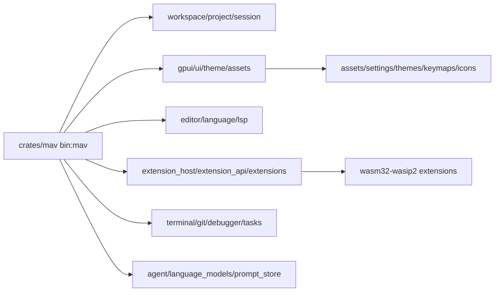

# Architecture

`mav` keeps the editor architecture intact while removing unrelated repository surface area. The main binary lives in `crates/mav`, but it composes dozens of workspace crates for rendering, editing, language intelligence, workspace state, extensions, Git, terminal integration, AI features, and platform support.

## Core Boundaries

`crates/mav` is the composition crate. It wires the product together and owns the binary entrypoint.

`crates/gpui*` owns the UI runtime and platform rendering backends.

`crates/editor`, `crates/language`, `crates/lsp`, and `crates/project` own text editing, language state, diagnostics, and project model behavior.

`crates/extension_*` and `extensions/` own extension APIs, extension host behavior, and bundled extension examples.

`assets/` contains runtime data. Treat it as code: settings, keymaps, themes, icons, and prompts affect editor behavior.

## Pruning Policy

Keep code required to build, test, package, and run the editor and extensions. Remove public project operations, website deployment, issue triage, sponsorship, hosted legal pages, and organization-specific release automation unless a private dotbrains workflow needs them.

Large files remain where they are domain data, generated fixtures, lockfiles, binary assets, or mature implementation modules whose split would be higher-risk than useful. Split large files only when a responsibility boundary is obvious and tests can cover the move.
