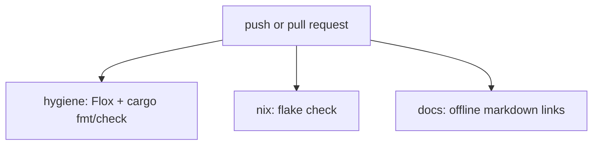

# CI

CI is intentionally small for the public port. It verifies formatting, the main editor binary, the Nix flake, and documentation links.



## Runner Policy

All Linux jobs run in GitHub-hosted cloud runners:

```yaml
runs-on: ubuntu-latest
```

Do not introduce self-hosted, Blacksmith, or other third-party runner labels unless a job explicitly needs dedicated infrastructure and documents why GitHub-hosted runners are insufficient.

## Adding Jobs

Prefer small jobs with clear ownership:

- `hygiene` for formatting, linting, and quick compile checks.
- `test` for targeted Rust test suites.
- `nix` for package and flake validation.
- `docs` for documentation quality gates.

Keep secrets out of CI unless a private deployment or release workflow explicitly needs them.
